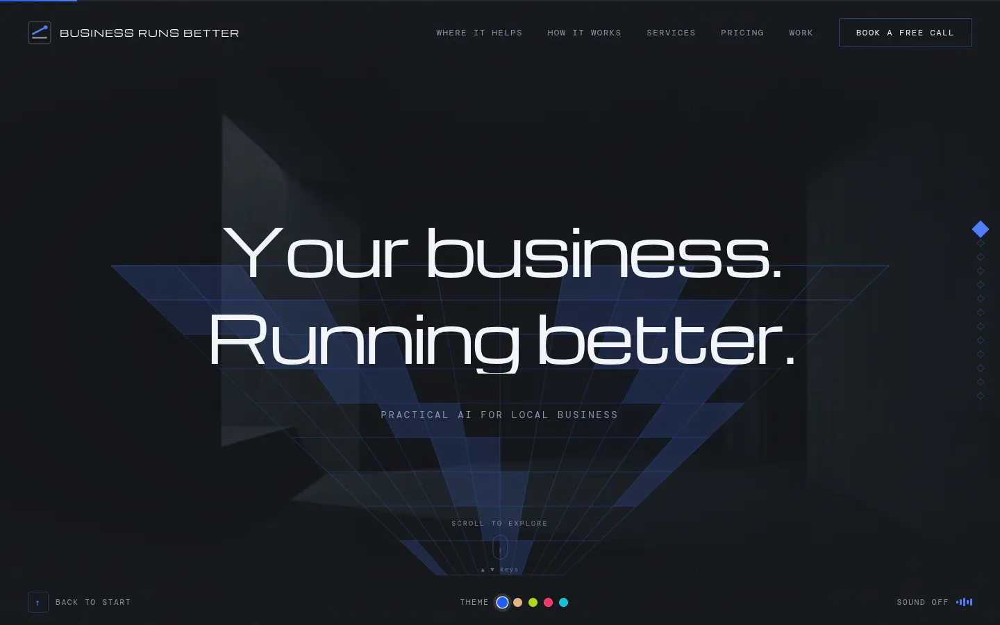
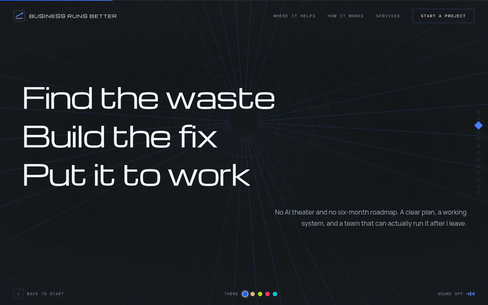

# Business Runs Better — interactive experience

A single-page, full-screen scroll experience for an AI consultancy. Thirteen sections,
each with its own procedurally generated canvas background, morphing between states as
you navigate.

**[Live demo →](https://mikecavallo.github.io/business-runs-better-experience/)**




No frameworks. No build step. No CDN. One HTML file and a folder of assets.

---

## What's interesting here

**Thirteen procedural canvas patterns, hand-written.** Perspective grid, hexagonal mesh,
converging rays, ripples, lightning, circuit traces, DNA helix, force-directed nodes,
constellation, rising bars, layered cards, a neural network, and expanding superellipse
rings. Each is a pure function of `(ctx, width, height, time, dissolve)` — the
`dissolve` parameter is what makes them morphable.

**Morph transitions.** Navigating cross-fades two patterns by running both with inverse
dissolve values, wrapped in a canvas warp (scale + rotate), a shockwave ring, a 60-particle
burst with motion trails, a midpoint flash with vignette, and a scan sweep. All on a
single 2D context.

**Five themes, one source of truth.** Every colour in the project resolves from two
places: a `--brand-rgb` custom property for CSS and a `PC` constant for the canvas.
Adding a theme is one object entry. The photographic backdrops are lit with a single
hue, so each theme rotates them with a CSS `hue-rotate` to match rather than shipping
five sets of images.

**Pre-rendered neural narration.** Optional voice-over for all thirteen sections,
generated offline with [Kokoro](https://github.com/hexgrad/kokoro) and shipped as 619 KB
of static mp3. There is no TTS service in production and no inference latency — it's
just `<audio>`. Browser `speechSynthesis` remains as a fallback. Re-render with
`render-narration.py`.

**Gesture-accurate navigation.** One scroll gesture advances exactly one section: the
wheel locks until the gesture (including trackpad momentum) has been idle for 320 ms.
Sections that overflow their viewport scroll internally first, and only hand the gesture
to section-navigation once you've reached the edge — so content is never unreachable on
a small screen.

---

## Accessibility

Not an afterthought; the constraints shaped the build.

- **WCAG AA verified across all five themes** — 35 colour-pair checks, all passing.
  Themes whose brand colour is light (brass, acid) carry their own `--on-brand` text
  colour rather than assuming white.
- Inactive sections are `inert`, so they're removed from the tab order and the
  accessibility tree entirely.
- Section changes announce through an `aria-live` region.
- Headings are real text in the markup; JavaScript enhances them into per-character
  spans rather than creating them. The page has ~4,000 indexable characters with
  JavaScript disabled.
- `prefers-reduced-motion` disables the warp, shockwave, particle burst, flash, scan
  sweep, splash choreography, and per-character stagger, and shortens transitions to
  a cross-fade.
- Full keyboard navigation; key-repeat can't chain sections.

---

## Performance

| | |
|---|---|
| Total page weight | ~1.0 MB (400 KB without the optional narration) |
| Fonts | 144 KB, self-hosted, Latin subsets only |
| Images | 100 KB — six WebP scenes |
| External requests | **zero** |
| Dependencies | **zero** |

Canvas is capped at 2× DPR and pauses `requestAnimationFrame` when the tab is hidden.

---

## Running it

Any static server:

```bash
python3 -m http.server 8000
```

Then open `http://localhost:8000`. The contact form needs PHP (see below); without it,
the form falls back to opening a pre-filled email.

### Deploying (Bluehost / any cPanel host)

Upload these to `public_html/`:

```
index.html  about.html  pricing.html  work.html  thanks.html  privacy.html  terms.html
contact.php  leads.php  stripe-webhook.php  brb-lib.php
.htaccess  robots.txt  sitemap.xml  assets/
```

Then create a folder **next to** `public_html` (not inside it) called `brb-private/`, and put
`config.sample.php` in it renamed to `config.php`. Set at least `admin_password` and
`contact_to`. The lead database and CSV backup are created in that folder automatically.

| File | What it does |
|---|---|
| `contact.php` | Saves each inquiry to the lead tracker, emails you, sends the visitor an instant acknowledgement, pushes to your phone (ntfy, optional), and appends a CSV backup. Honeypot, fill-time check and per-IP rate limit against spam. |
| `leads.php` | Password-protected lead tracker: follow-ups due today, pipeline by status, notes timeline, deal values, payments, CSV export. |
| `stripe-webhook.php` | Records Stripe payments against the right lead (by email), moves its status forward, and emails you. Verifies Stripe's signature; needs no API key. |
| `assets/site-config.js` | Public settings: Stripe Payment Link URLs, booking-calendar links, and testimonials for the About page (hidden while empty). Empty links fall back to the contact form. |
| `.htaccess` | HTTPS on the bare domain, clean URLs (`/pricing`), blocks private files, cache headers. |

### Stripe setup

1. **Payment Link for the audit.** Stripe → Payment Links → New: product "Time Audit", $500, one time.
   Under *After payment*, choose "Don't show confirmation page" and redirect to
   `https://businessrunsbetter.com/thanks.html`. Paste the link URL into `stripe.timeAudit` in
   `assets/site-config.js`.
2. **(Optional) Run & Improve.** A recurring $300/month Payment Link to send to clients after a
   build; paste it into `stripe.runAndImprove` if you want it on the site.
3. **Builds.** Send Stripe Invoices from the dashboard (50% deposit, 50% on handoff).
4. **Webhook.** Stripe → Developers → Webhooks → Add endpoint
   `https://businessrunsbetter.com/stripe-webhook.php`, events `checkout.session.completed` and
   `invoice.paid`. Copy its signing secret (`whsec_...`) into `stripe_webhook_secret` in
   `brb-private/config.php`.
5. Test with Stripe's test mode first: a test payment should show up in `/leads.php` as
   "Audit paid" within seconds.

### Re-rendering the narration

Requires a local [Kokoro-FastAPI](https://github.com/remsky/Kokoro-FastAPI) on port 8880.
Development only — the deployed site never touches it.

```bash
python3 render-narration.py --voice bm_george
```

Any of Kokoro's 67 voices works. Takes about 3 seconds for all thirteen lines.

---

## Structure

```
index.html              everything — markup, styles, canvas engine, theme system
about.html, pricing.html, work.html   standard pages, plus thanks/privacy/terms
assets/about.js         About page animations; testimonials render from site-config.js
assets/site.css|js      shared styles and behavior for the standard pages
assets/site-config.js   Stripe Payment Links and booking links (public)
contact.php             contact form handler (lead tracker + email + CSV backup)
leads.php               private lead tracker
stripe-webhook.php      Stripe payment → lead tracker
brb-lib.php             shared PHP helpers (database, mail)
config.sample.php       template for ../brb-private/config.php
.htaccess               HTTPS, clean URLs, caching and security headers for Apache hosts
assets/fonts/           Michroma (display), Manrope (body), DM Mono (labels)
assets/img/             six generated WebP scenes
assets/audio/           pre-rendered narration clips (browser TTS covers any missing one)
render-narration.py     narration build script (dev only)
```

---

## Credits

Typography: [Michroma](https://fonts.google.com/specimen/Michroma),
[Manrope](https://fonts.google.com/specimen/Manrope),
[DM Mono](https://fonts.google.com/specimen/DM+Mono).
Narration: [Kokoro-82M](https://huggingface.co/hexgrad/Kokoro-82M).
Imagery generated locally with SDXL.

Brand assets and copy © Business Runs Better.
